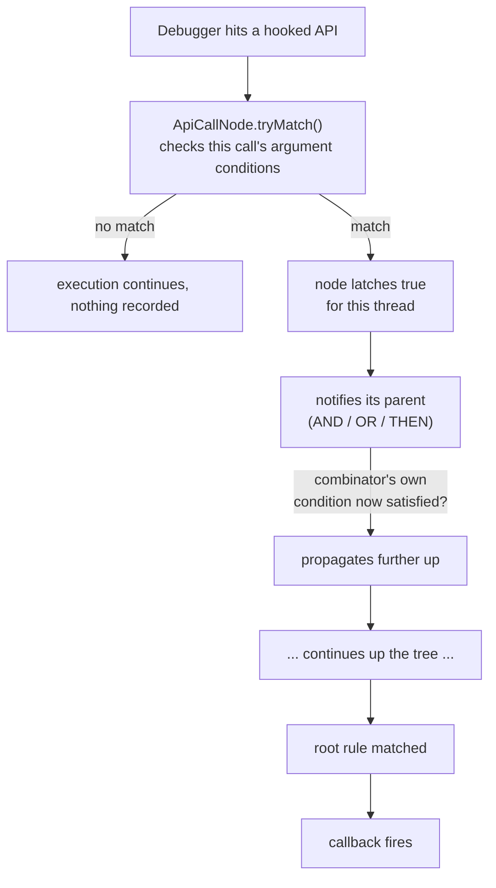

# capability-breakpoints

**Express malware capabilities as conditional breakpoints; matched live, during
a real debugging session, instead of reconstructed after the fact from sandbox output/log.**

> **Status: early / work in progress.** The core engine (grammar, AST, evaluation
> runtime) is built. The debugger integration (`debuggers/x64dbg`) is not in this
> repository yet — see [Roadmap](#roadmap).

---

## The problem

Traditional breakpoints answer one question: *"has execution reached this
address?"* Detecting a **capability** (a malware behavior like process
injection or in-memory unpacking ) is rarely about one address. It's a
pattern: *this API call, with an argument that looks like this, followed
eventually by that API call, or that other one.* Today, expressing that
during a live debugging session means writing one-off scripts by hand, every
time.

`capability-breakpoints` turns that pattern into a small, declarative
language, and compiles it directly into a tree of conditional breakpoints
that a debugger evaluates as your target actually runs.

## Example

```
VirtualAlloc(,, 0x4000) and VirtualProtect(["MZ":])
    then CreateProcessW() or CreateRemoteThread()
```

Reads as: *a `0x4000`-flagged allocation, whose contents start with `MZ`,
followed by either spawning or hollowing a new process.* Each `apiCall` can
constrain arguments by literal value, or by dereferencing a pointer argument
and matching a byte pattern in the memory it points to (`["MZ":]`, with
support for exact/prefix/suffix/contains matching, wildcard bytes, and
fixed-offset anchoring).

## How it works



1. A rule is parsed by an **ANTLR4 grammar** into a parse tree.
2. The parse tree is translated into a small, independently-owned **runtime
   AST** — `AND`/`OR`/`THEN` combinator nodes over `ApiCall` leaves — decoupled
   from ANTLR entirely past this point.
3. The debugger backend installs one hook per distinct API name referenced
   anywhere across all loaded rules, and dispatches hits by name into an
   index of the `ApiCall` nodes that care about it.
4. Matching is **event-driven and per-thread**: a leaf becoming true notifies
   its parent, which applies its own combining rule (all children for `AND`,
   any child for `OR`, in-order stages for `THEN`) and, if that makes *it*
   newly true, notifies its own parent all the way to the root.

This engine is deliberately debugger-agnostic — everything above talks to a
small abstract interface (thread id, register/argument access, memory
reads), not to any specific debugger's API. `debuggers/x64dbg` (planned) is
the first concrete backend, targeting x64dbg's plugin SDK.

## Repository layout

```
.
├── engine/              # grammar, AST translation, evaluation runtime — debugger-agnostic
├── debuggers/x64dbg/    # x64dbg plugin backend (not yet added)
└── cmake.toml           # cmkr project definition
```

## Roadmap

- [x] Grammar: boolean/temporal combinators (`AND` / `OR` / `THEN`), positional
      and skippable arguments
- [x] Memory pattern matching: exact / prefix / suffix / contains, wildcard
      bytes, fixed-offset anchoring
- [x] Runtime: event-driven, per-thread evaluation tree
- [ ] `debuggers/x64dbg`: plugin backend, API hooking, GUI panel for
      enabling/disabling individual conditions live
- [ ] Rule actions (dump memory, log, continue) for unattended/batch use


## Building

This project uses [cmkr](https://github.com/build-cpp/cmkr) — `cmake.toml`
is the source of truth; run `cmkr gen` to produce `CMakeLists.txt`, then
configure/build as usual. A C++17 compiler and the
[ANTLR4 C++ runtime](https://github.com/antlr/antlr4/tree/master/runtime/Cpp)
are required.

## License

TBD.