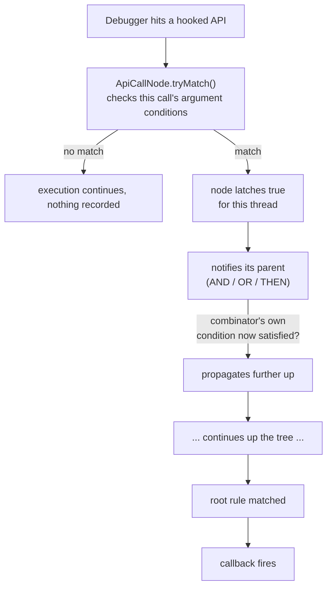

# capability-breakpoints

**Express malware capabilities as conditional breakpoints; matched live, during
a real debugging session, instead of reconstructed after the fact from sandbox output/log.**

> **Status: functional prototype.** Core functionalty, capability detection, and x64dbg GUI works. Next is better hooking mechanisms (api derouting instead of INT3) and perhaps some gui embelishments.

---

## TL;DR
Write rules that describe malware capabilities in the form of sequential boolean logic, wherein the predicates are WinAPI calls and their specific desired arguments to match on. The tool parses the expression, sets breakpoints at the start of each referenced WinAPI call as well as a callback function. When the callback function is fired (i.e., relevant WinAPI is called), it checks whether the passed arguments match any of the ones specified in any of the predicates in any of the installed rules. If so, if markes that predicate at True and parses upwards to see whether that predicate becoming true makes the rule's entire logical statement true. If so, it reports a match, otherwise, it resumes execution and the analyst would not have to inspect neither that specific WinAPI call, nor its arguments.

Rule expressions support AND, OR, NOT, and THEN. Arguments can be specified as normal values (i.e., decimal, hexadecimal, bytes), or using the memory dereference operator with (i.e., ["MZ":] for argument points to buffer starting with "MZ"; [:"MZ"] for argument points to buffer starting ending "MZ"; [:"MZ":] for argument points to buffer that has "MZ" somewhere in the middle; and ["PE"@0xf8] for argument points to buffer that has "PE" at offset 0xf8 from the start). WinAPI arguments can have boolean expressions, such as, WriteProcessMemory(,,["MZ":] or ["PE"@0xf8]), which matches when the third argument to WriteProcessMemory() contains an address pointing to a buffer that either starts with "MZ" or has "PE" at offset 0xf8.

Future planned improvements include using function detours, which would allow for cleaner breakpoint lists for debuggers that do not support internal/hidden breakpoints (such as x64dbg), and which would also allow for headless execution (i.e., ditch the debugger completely, and match rules directly capa-style, by relying on function detours/trampolines instead of breakpoints to get WinAPI calls).

Other planned improvments include supporting context sharing between API calls (i.e., detecting process injection using section mapping NtCreateSection(set targetSection) then (NtMapViewOfSection(is targetSection) and NtMapViewOfSection(is targetSection, set targetProcess)) then CreateRemoteThread(is targetProcess)).

Another planned improvement is actions: dump memory blobs into a file, modify registry/memory values then continue, process dump (to inspect in debugger at capability-match point), etc.

## The problem

Traditional breakpoints answer one question: *"has execution reached this
address?"* Detecting a **capability** (a malware behavior like process
injection or in-memory unpacking ) is rarely about one address. It's a
pattern: *this API call, with an argument that looks like this, followed
eventually by that API call, or that other one.* Today, expressing that
during a live debugging session means writing one-off scripts by hand, every
time.

`capability-breakpoints` turns that pattern into a small, declarative
language, and compiles it directly into a tree of conditional breakpoints
that a debugger evaluates as your target actually runs.

## Example

```
VirtualAlloc(,, 0x4000) and VirtualProtect(["MZ":])
    then CreateProcessW() or CreateRemoteThread()
```

Reads as: *a `0x4000`-flagged allocation, whose contents start with `MZ`,
followed by either spawning or hollowing a new process.* Each `apiCall` can
constrain arguments by literal value, or by dereferencing a pointer argument
and matching a byte pattern in the memory it points to (`["MZ":]`, with
support for exact/prefix/suffix/contains matching, wildcard bytes, and
fixed-offset anchoring).

## How it works


```mermaid
flowchart TD
    A["Debugger hits a hooked API"] --> B["ApiCallNode.tryMatch()\nchecks this call's argument conditions"]
    B -- "no match" --> Z["execution continues, nothing recorded"]
    B -- "match" --> C["node latches true\nfor this thread"]
    C --> D["notifies its parent\n(AND / OR / THEN)"]
    D -- "combinator's own\ncondition now satisfied?" --> E["propagates further up"]
    E --> F["... continues up the tree ..."]
    F --> G["root rule matched"]
    G --> H["callback fires"]
```

1. A rule is parsed by an **ANTLR4 grammar** into a parse tree.
2. The parse tree is translated into a small, independently-owned **runtime
   AST** (`AND`/`OR`/`THEN` combinator nodes over `ApiCall` leaves) decoupled
   from ANTLR entirely past this point.
3. The debugger backend installs one hook per distinct API name referenced
   anywhere across all loaded rules, and dispatches hits by name into an
   index of the `ApiCall` nodes that care about it.
4. Matching is **event-driven and per-thread**: a leaf becoming true notifies
   its parent, which applies its own combining rule (all children for `AND`,
   any child for `OR`, in-order stages for `THEN`) and, if that makes *it*
   newly true, notifies its own parent all the way to the root.

This engine is deliberately debugger-agnostic. Everything above talks to a
small abstract interface (thread id, register/argument access, memory
reads), not to any specific debugger's API. `debuggers/x64dbg` (planned) is
the first concrete backend, targeting x64dbg's plugin SDK.

## Repository layout

```
.
├── engine/              # grammar, AST translation, evaluation runtime (debugger-agnostic)
├── debuggers/x64dbg/    # x64dbg plugin backend (not yet added)
└── cmake.toml           # cmkr project definition
```

## Roadmap

- [x] Grammar: boolean/temporal combinators (`AND` / `OR` / `THEN`), positional
      and skippable arguments
- [x] Memory pattern matching: exact / prefix / suffix / contains, wildcard
      bytes, fixed-offset anchoring
- [x] Runtime: event-driven, per-thread evaluation tree
- [x] `debuggers/x64dbg`: plugin backend, API hooking, GUI panel for
      enabling/disabling individual conditions live
- [ ] Rule actions (dump memory, log, continue) for unattended/batch use


## Building

This project uses CMake presets with Ninja.

### Prerequisites

- Visual Studio 2022 with the C++ workload
- CMake
- Ninja
- Java 25+ for regenerating the ANTLR4 grammar

### Configure and build

Configure the desired debugger backend using its CMake preset, then build using the corresponding build preset.

#### x64dbg

```powershell
cmake --preset ninja-release-x64dbg
cmake --build --preset x64dbg
```


All configurations use the same `build-ninja` directory. CMake/Ninja will only rebuild targets whose configuration or sources have changed.

### Regenerate the ANTLR4 grammar

The generated parser/lexer sources are checked into the repository. If `engine/CapabilityDSL.g4` changes, regenerate them with:

```powershell
cmake --build --preset grammar
```

This only runs the `capbp_regenerate_grammar` target; it does not build a debugger plugin.

Java 25 or newer is required to run the ANTLR 4.13.2 generator.

### Build output

The CMake build directory is:

```text
build-ninja/
```

`compile_commands.json` is generated there when configuring the project and can be used by clangd for C++ language tooling.

## License

TBD.